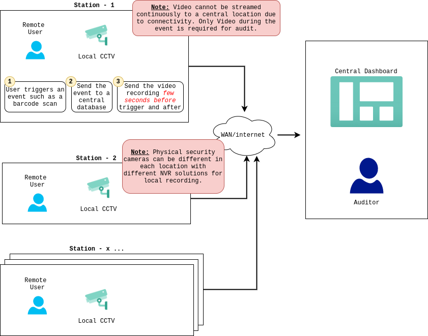
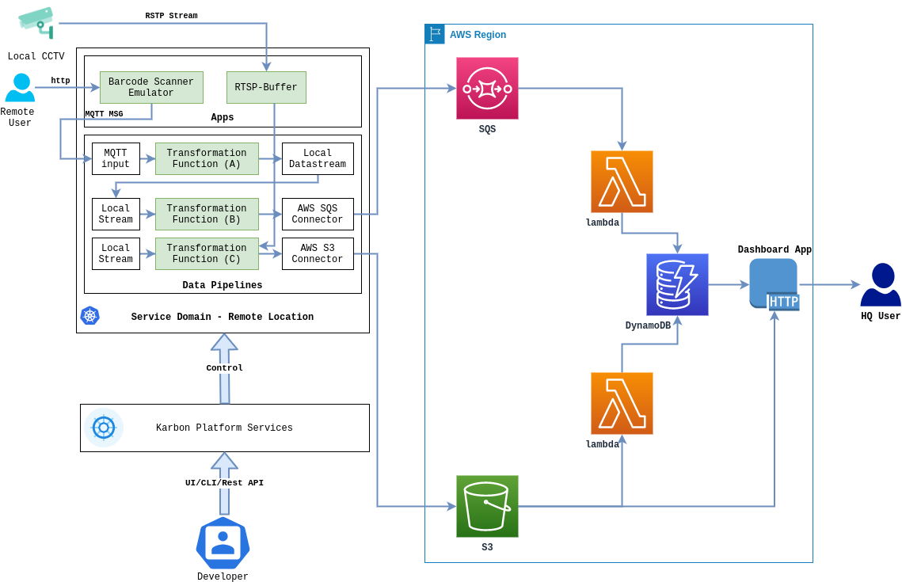

# kps-dvs

KPS-DVS is a demo application for distributed video surveillance based on Nutanix Karbon Platform Services. The challenge while working with such projects is the connectivity between the remote sites and the centralized DC or Cloud and the non standard API interfaces for NVRs (depending on the vendor).

  

With this sample project we demonstrate how we can use Nutanix KPS to implement such a distributed system regardless on the local NVR or video storage vendor.

  

Video will not be stream continuously to main site, instead a trigger will determine the require video capture timeframe. Usually few seconds before the trigger event and few seconds after that.

